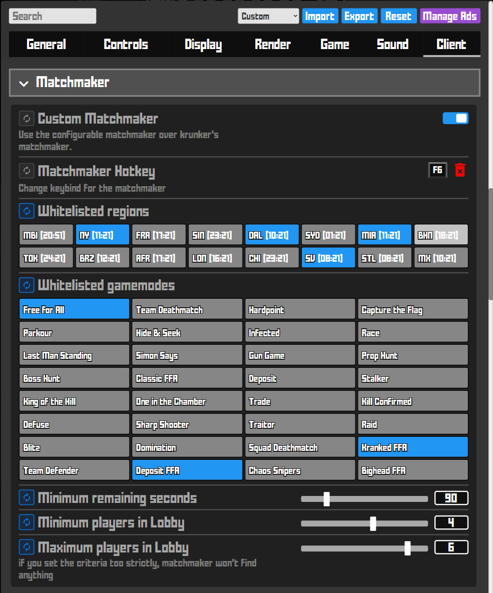

# crankshaft

> **a fast, feature-rich krunker client written in typescript**
  

---

##  Download

| Platform | Link |
|---------|------|
|  Windows (x64) | [Download](https://github.com/KraXen72/crankshaft/releases/latest/download/crankshaft-setup-win-x64.exe) |
|  Mac (x64) | [Download](https://github.com/KraXen72/crankshaft/releases/latest/download/crankshaft-portable-mac-x64.dmg) |
|  Mac (arm64) | [Download](https://github.com/KraXen72/crankshaft/releases/latest/download/crankshaft-portable-mac-arm64.dmg) |
|  Linux (x86_64 AppImage) | [Download](https://github.com/KraXen72/crankshaft/releases/latest/download/crankshaft-portable-linux-x86_64.AppImage) |
|  Others | [See All Releases](https://github.com/KraXen72/crankshaft/releases/latest) |

---

---
  

<strong>Client Features:</strong>

- very good performance with additional performance enhancing settings
- unobtrusive
  - no clan colors
  - no watermarks
  - all features can be disabled
- highly customisable, many different settings
- _hides_ ads by default (can be disabled)
- resource swapper (sounds & all other assets)
- css swapper
- userscript support
- discord RPC (gamemode, map, class & skin)
- customisable matchmaker (Gamemode, Region, Min/Max players, Time)
- quick class switcher using `#hiddenClasses`
- built-in hotkeys: [more about them here](#hotkeys)
- maintained & open source

 
 

##  Quality of Life

<ul>
  <li> <strong>Very lightweight</strong>
    <ul>
      <li>Only 100kb of JavaScript combined</li>
      <li>Dependencies are carefully chosen (currently, there are 3)</li>
    </ul>
  </li>
  <li> <strong>No-compromise Mac, Linux and Windows support</strong></li>
  <li> <strong>Secure:</strong> <code>web security</code> is on, the <code>remote</code> module and <code>nodeIntegration</code> are disabled</li>
  <li> Splash screen is not a separate window, shows only while Krunker is actually loading</li>
  <li> <strong>Discord RPC : </strong> if enabled, only updates while you're not in-game. Does not use <code>setInterval</code> like other clients</li>
</ul>

 
 

##  Userscripts

<ul>
  <li> Any <code>.js</code> file in <code>%APPDATA%/crankshaft/config/scripts</code> will be considered a userscript and executed if enabled in settings.</li>
  <li> There are a few official/example userscripts:
    <ul>
      <li><a href="https://gist.github.com/KraXen72/2ea1332440b0c66b83ca9b73afc38269"><code>keystrokes.js</code></a>: shows WASD, shift, space and 2 configurable keys on screen.</li>
      <li><a href="https://gist.github.com/KraXen72/270b2b8f28dda974f9e643b384e87a68"><code>autospectate.js</code></a>: automatically joins game as spectator if turned on.</li>
    </ul>
  </li>
  <li>⚠️ All userscripts are disabled when they are first added.</li>
  <li>📁 <code>%APPDATA%/crankshaft/config/tracker.json</code> is used to keep track of enabled userscripts.</li>
</ul>

   If you want to write a userscript or learn more about them, read the <a href="./USERSCRIPTS.md">Documentation</a>

<blockquote>
  <strong>⚠️ Use userscripts at your own risk</strong>: The author(s) of this client are <strong>not responsible for any damage</strong> caused by userscripts, as the user is the author of the script. 
  ❌ <strong>Do not write or use userscripts which give the user a competitive advantage.</strong>
</blockquote>

  
 
 

##  Hotkeys

Press <code>Alt</code> to show the Electron menu. Here you can find all hotkeys. 
Standard hotkeys like zooming, copying/pasting, and devtools are also included.

<strong>Client's hotkeys:</strong>

<table>
  <thead>
    <tr>
      <th style="text-align:left;"> Key</th>
      <th style="text-align:left;"> Action</th>
    </tr>
  </thead>
  <tbody>
    <tr><td><code>F5</code></td><td>Reload</td></tr>
    <tr><td><code>F6</code></td><td>Find new match</td></tr>
    <tr><td><code>F7</code></td><td>Copy game link</td></tr>
    <tr><td><code>Ctrl + F7</code></td><td>Join game from clipboard</td></tr>
    <tr><td><code>F12</code></td><td>Devtools (alternate)</td></tr>
  </tbody>
</table>

 
 

##  Matchmaker

A customizable matchmaker <strong>(with GUI settings!)</strong> that you can use alongside or instead of the regular <code>F6</code>.

 
 

## 🛠️ Building from Source

<ol>
  <li><strong>You have to have 
    <a href="https://git-scm.com/downloads">git</a>, 
    <a href="https://nodejs.org/en/download/">nodejs</a>, and 
    <a href="https://pnpm.io/installation">pnpm</a> installed</strong>.
  </li>
  <li><strong>Installation:</strong>   
    <pre><code>git clone https://github.com/KraXen72/crankshaft
cd crankshaft
pnpm i</code></pre>
  </li>
  <li><strong>Building from source:</strong>  
    <pre><code>pnpm dist</code></pre>
  </li>
</ol>

   
  

### 🤝 Contributing

<ol>
  <li>Follow previous steps 1 & 2 from <strong>Building from Source</strong>.</li>

  <li>Make your changes + run from source:
    <pre><code>pnpm start
# or
pnpm dev</code></pre>
    <ul>
      <li>🔁 Rebuilds on changes, refresh Krunker with <code>F6</code></li>
      <li>✅ Make sure to run the code through the configured <code>eslint</code> before contributing (VS Code will enable it if you have the extension).</li>
    </ul>
  </li>

  <li>After your changes, try it out with:
    <pre><code>pnpm testbuild</code></pre>
    <ul>
      <li>This will minify the code & run the app.</li>
      <li>Until automated tests are added, test manually after minification. If it doesn't work, something’s probably wrong.</li>
    </ul>
  </li>
</ol>

<ul>
  <li> Please report any bugs/feature requests in the <strong>Issues</strong>.</li>
  <li> Feel free to submit pull requests — they will be merged as long as they support the client ideology.</li>
</ul>

#### Wanted/potential features
- here are some features i wanted to add, but don't have the time to
- if you're looking to contribute, feel free to open pr's for these
- [ ] **Matchmaker: Map autocomplete**
  - create a simple typeahead/autocomplete for the matchmaker, where you can input maps (official ones)
    - you can get more info about maps from [this krunker api link](https://matchmaker.krunker.io/game-list?hostname=krunker.io) or the [client code](https://github.com/KraXen72/crankshaft/blob/master/src/matchmaker.ts)
    - [Wes Bos' Javascript30 free course (episode 6)](https://javascript30.com) is a tutorial on how to implement a typeahead in vanilla js
      - (you'd use typescript but it's very similar)
  - allow toggling the list of maps between whitelist/blacklist
  - take this white/blacklist into account when using the matchmaker
- [ ] **Add tests**
  - could be useful, testing a few thigs like: if the game loads, if settings load, if you can set a setting, etc.
- [ ] **Add autoupdate** (whatever official way electron recommends)
  - i tried to add this once and failed.
  - honestly good luck since this client uses an ancient electron version due to all the newer ones having a bug that causes aim freeze in krunker

### Credits
- [Creepycats](https://github.com/creepycats) released [Gatoclient](https://github.com/Gatohost/gatoclient), which was based on top of [idkr](https://github.com/idkr-client/idkr).
- Crankshaft was built on top of [Gatoclient lite](https://github.com/LukeTheDuke240/gatoclient-lite), an `app.asar` mod optimizing Gatoclient by [LukeTheDuke](https://github.com/LukeTheDuke240).
- Very little code remains, as Crankshaft was rewritten in typescript & more features were added.
- Gatoclient was later rewritten, implementing some code from Crankshaft too.
- **other acknowledgments**
  - [All contributors](https://github.com/KraXen72/crankshaft/graphs/contributors)
  - [wa/paintingofblue](https://github.com/paintingofblue) - matchmaker implementation
  - [Commander/asger-finding](https://github.com/asger-finding) (AKC client) - resource swapper implementation
  - [Tae](https://github.com/whuuayu) - awesome logo for the client <3

## Support development

 
  
You can support ongoing development & maintainance by donating. All donations are highly appreciated! <3
