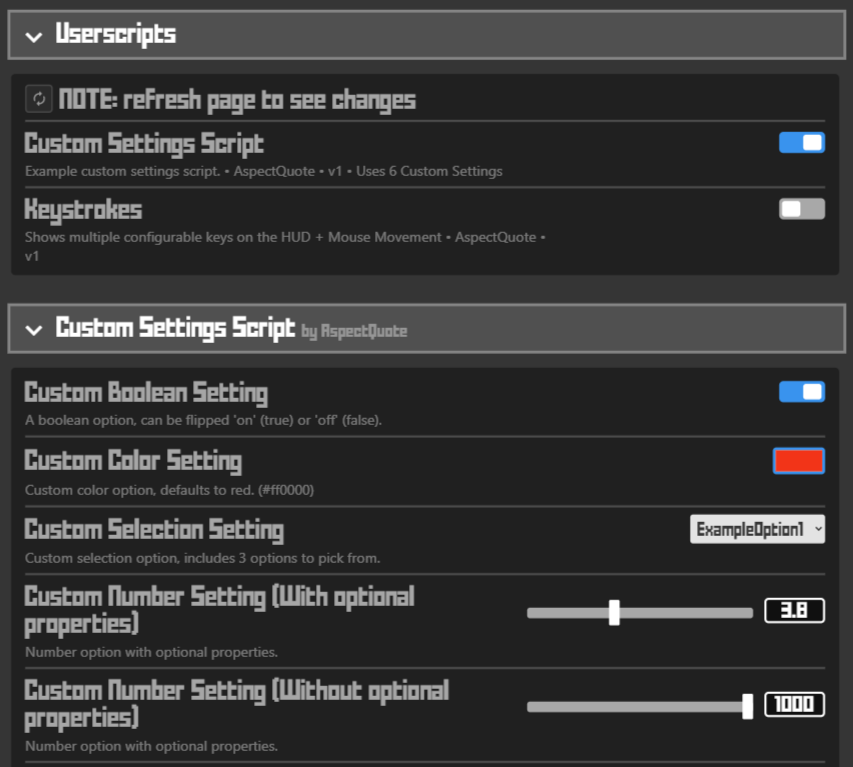
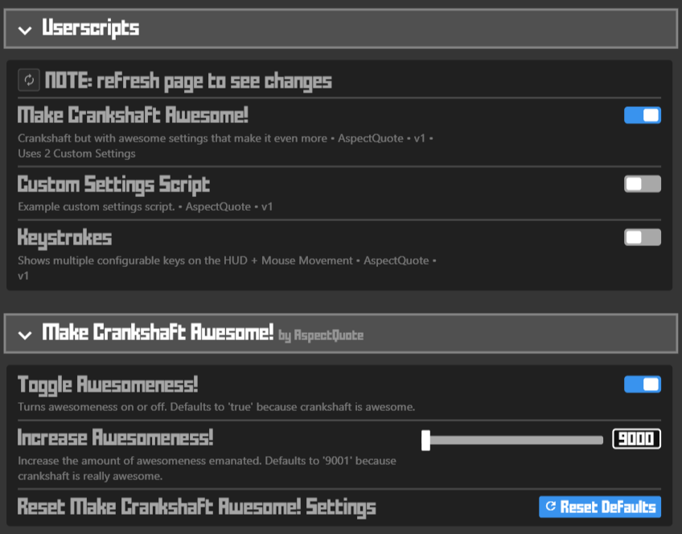

# Writing userscripts for crankshaft

Writing userscripts for crankshaft is easy. You don't need to follow any template, but it is recommended you make use of stuff below.  
There are a few example userscripts mentioned in the README you can go off of.  

- [Writing userscripts for crankshaft](#writing-userscripts-for-crankshaft)
	- [Metadata](#metadata)
		- [Example](#example)
		- [Template to copy](#template-to-copy)
		- [optional @run-at rule](#optional-run-at-rule)
	- [Waiting for a function to exist](#waiting-for-a-function-to-exist)
		- [Explanation/notes](#explanationnotes)
		- [Template to copy](#template-to-copy-1)
	- [Utility functions](#utility-functions)
		- [Unload function (version 1.6.0+)](#unload-function-version-160)
		- [Console access (version 1.6.0+)](#console-access-version-160)
		- [Insert CSS (version 1.6.1+)](#insert-css-version-161)
		- [Custom Krunker Settings (version 1.9.0+)](#custom-krunker-settings-version-190)
	- [Tips / Notes](#tips--notes)
		- [removing an eventListener easily:](#removing-an-eventlistener-easily)
		- ['once' attribute on eventlisteners](#once-attribute-on-eventlisteners)
	- [Enabling and testing your userscript](#enabling-and-testing-your-userscript)
		- [crankshaft version 1.9.0+](#crankshaft-version-190)
		- [crankshaft version \<1.9.0](#crankshaft-version-190-1)
  
> Warning: Goes without saying, but you should never write userscipts that break [Krunker's Terms & Conditions](https://krunker.io/docs/terms.txt), like hacks or selfbots. Crankshaft maintainers are not responsible for scripts YOU write and your account can get banned.
  
> Note: Userscripts written before 20th January 2023 may not work if not updated, because krunker changed some things related to script injection.

## Metadata

Crankshaft recognizes standard userscript metadata comment, but only a subset of keys.  
You can define `@name`, `@author`, `@ersion`, `@desc`, `@src`, `@license` as strings.  
There is also an optional `@run-at` rule, more about that [here](#optional-run-at-rule)  
Defining metadata is optional. If no metadata is provided, only information displayed will be the filename.

You can define only some of them if you want, for example `@name` and `@desc`  
  
### Example

```js
// ==UserScript==
// @name My Awesome Userscript
// @author Unlucky1031
// @version 1.0
// @desc Adds a ton of awesomness to the game
// @license MIT; https://mit-license.org
// @src https://github.com/Unlucky1031/crankshaft-userscript
// @run-at document-end
// ==/UserScript==

this._console.log("Everything is awesome! Everything is cool when you're part of a team!")
```
  
### Template to copy

Copy this template to the top of your userscript for crankshaft to recognize it.  

```js
// ==UserScript==
// @name 
// @author 
// @version 
// @desc 
// @src
// @run-at document-end 
// ==/UserScript==
```

### optional @run-at rule

You can define an optional `@run-at` rule.

- `document-end` **(default)**  
  The script executes when DOMContentLoaded is fired. At this time, the basic HTML of the page is ready and other resources like images might still be on the way. This will be picked if no `@run-at` rule is defined.
- `document-start`
  The script executes as soon as possible. `body` most likely won't have any content in it yet.

## Waiting for a function to exist
While krunker is loading, you might already have existing dom elements, (`@run-at` is set to `document-end` by default) but the functions in their `onclick`'s don't exist yet. You can do something like this:
```js
// ==UserScript==
// @name auto-spectate
// @author KraXen72
// @version 2.0.0
// @desc automatically switch to spectator mode	
// @run-at document-end 
// ==/UserScript==


const has = (object, key) => Object.prototype.hasOwnProperty.call(object, key);
let interval = null

function checkSpect() {
	if (has(globalThis, "setSpect") && typeof globalThis.setSpect === 'function') {
		globalThis.setSpect(true)
		clearInterval(interval)
		this._console.log("sucessfully set spectator mode!")
	}
}

interval = setInterval(() => checkSpect.apply(this), 250)

this.unload = () => clearInterval(interval) 
return this
```
### Explanation/notes
- `globalThis` **can be used interchangably with** `window` **in this case.** - [more details](https://developer.mozilla.org/en-US/docs/Web/JavaScript/Reference/Global_Objects/globalThis)
- **we use a custom `has` function to check if a function exists on window**. <u>**you can just copy-paste it**</u>, but here's a technical explanation for those interested:
  - Unlike the `in` operator, this method does not check for the specified property in the object's prototype chain. - [source (MDN)](https://developer.mozilla.org/en-US/docs/Web/JavaScript/Reference/Global_Objects/Object/hasOwnProperty#description)
  - ideally, we'd use `Object.hasOwn`, but that's supported only in chrome >= 93 (not our case)
  - you *can* use `window`/`globalThis.hasOwnProperty('key')`, however, `hasOwnProperty` is not a protected keyword - [more details](https://developer.mozilla.org/en-US/docs/Web/JavaScript/Reference/Global_Objects/Object/hasOwnProperty#using_hasownproperty_as_a_property_name)
  - thus, we have to use `Object.prototype.hasOwnProperty.call(object, key)`, which always sources the function from the `Object.prototype`
  - if you're thinking this is too paranoid, even eslint yells at you about using `hasOwnProperty` from a source other than `Object.prototype`
- **clear the interval after you run your stuff!!!** `setInterval` is one of the most performance heavy function. it literally schedules a function to be ran every x ms. ***unless*** that's what you want to do, clear the interval after you're done.
- **unless your callback is an arrow function, use `callback.apply(this)`.** we have to run `checkSpect.apply(this)` instead of just `checkSpect()` because in that case the `this` keyword will no longer have our helper functions like `_css`, `_console`, etc.
- if you want to wait for more functions, you can define more intervals & callback under different names. but honestly once 1 function exists, others probably exist too. so you should be fine only waiting for 1 of them.
- i think normal functions technically get hoisted to the top so doing `const interval = setInterval` without the initial let definition *should* also work, but i haven't tested it.
  
### Template to copy
```js
const has = (object, key) => Object.prototype.hasOwnProperty.call(object, key);
let interval = null

function callback() {
	clearInterval(interval)
}
interval = setInterval(() => callback.apply(this), 250)

this.unload = () => clearInterval(interval) 
return this
```


## Utility functions

Userscripts are executed with a custom javascript `this` object. It exposes some utilities and you can define some lifecycle functions.
  
### Unload function (version 1.6.0+)

if you want users to be able to turn on and off your userscript without reloading the page, define a `this.unload` function.
The `this.unload` function is not required, but highly recommended, because users can freely toggle your userscript on and off without reloading the page.  
That's why it's also important you try to undo all the stuff you do in the userscript.  
This function should **delete all elements you create**, **remove all eventlisteners** and basically **undo the changes you made to the game**.  
  
```js
// example which exports an unload function

function clickCb() {
  window.alert("Hello!")
}

let myElem = document.createElement("div")
myElem.id = "mediocre-element"
myElem.style.color = "pink"
myElem.style.background = "violet"
myElem.textContent = "Hello world!"
myElem.addEventListener("click", clickCb) // added some on click action

document.body.appendChild(myElem) // added the element to body

this.unload = () => {
  let toRemoveElem = document.getElementById("mediocre-element") // get the element by id / queryselector rather than use the myElem reference
  toRemoveElem.removeEventListener("click", clickCb) // remove any eventlisteners you added to be safe
  toRemoveElem.remove() // remove the element
}

return this

```

### Console access (version 1.6.0+)

Krunker disables console methods like `log`, `warn`, `error` and others. If you want to use console, you can access it with `this._console`. It only provides the three basic methods mentioned above: `log`, `warn` and `error`.  
You do not need to return `this._console`, it will have no effect.
  
```js
this._console.log("everything is awesome!")
```

### Insert CSS (version 1.6.1+)

Electron offers a function to inject (and uninject) css into a page.  
It has multiple advantages: the page **can't remove the css** and **has no idea who or how it is inserted**. You can utilise this in your userscripts with the `this._css` function. It takes 3 arguments:

- **css (string)**: the css you want to inject
- **identifier (string)**: the identifier for this css block, so you can later remove it in the `this.unload` function
- **value ('toggle' or boolean, optional)**: `true` to inject, `false` to uninject, `toggle` or nothing to toggle
  
```js
// ==UserScript==
// @name Remove reCaptcha bar on linux
// @author Commander (modified by KraXen for this example)
// @run-at document-start
// ==/UserScript==

// add some css to hide the recaptcha bar on linux
const cssBody = `body > div:not([class]):not([id]) > div:not(:empty):not([class]):not([id]) { display: none; }`
this._css(cssBody, 'recaptcha', true)

// remove the css when userscript is unloaded
this.unload = () => {
  this._css(cssBody, 'recaptcha', false)
  // you could even use this._css('', 'recaptcha', false)
  // as long as you use the correct identifier, the css doesen't matter for removing
}

// we have to return this since we define an unload function
return this
```
example 2 (selectable chat):
```js
"use strict";
this._css(".chatItem * { user-select: text; }", "select-chat", true);
this.unload = () => { this._css('', 'select-chat', false); };
return this;
```

### Custom Krunker Settings (version 1.9.0+)

Beginning in version 1.9.0, crankshaft supports the ability for scripts to **easily** inject their own custom settings into Krunker, allowing for userscript creators to implement easy-to-change settings into the client.


Doing this is very easy! All you have to do is include a `.settings` property on your script's root `this` object!

```js
// ==UserScript==
// @name Super Awesome Script
// @author You!
// @version 69
// @desc Super epic script that could use some custom settings.
// ==/UserScript==

this.settings = {}

return this // Make sure you include this part!
```

That's all you have to do! Obviously though, it's not super useful to have no custom settings. Thankfully, it's simple to implement plenty of custom settings. Let's walk through adding a custom setting step-by-step.

#### Step 1 - Add the setting key:
```js
this.settings = {
	"mySuperAwesomeCustomSetting": {
		/* Setting properties go here */
	}
}
```
When you add a property to the `settings` object, crankshaft will recognize it as a setting it needs to display. This key will be used to store the setting's value when it's saved to disk. This can be anything, but follow standard JavaScript object property guidelines. (No spaces or special characters.)

#### Step 2 - Add the required setting properties:
```js
this.settings = {
	"mySuperAwesomeCustomSetting": {
		"title": "Toggle Awesomeness!", /* NEW */ 
        "type": "bool", /* NEW */ 
        "value": true /* NEW */ 
	}
}
```
After you add the properties to your custom setting, crankshaft will know what kind of setting it is. Let's walk through what each setting property does.

Custom Setting Required Schematic
- `mySuperAwesomeCustomSetting` Setting key. Explained above in Step 1.
	- `title`: _string_ - This will be what the setting name is. (i.e. "Default Region", "Render Distance")
	- `type`: _string_ - The type of setting the setting is. Can be 'bool' (boolean), 'num' (number), 'sel' (selection), or 'color' (color).
	- `value`: _boolean|number|string_ - The default value for the setting. The type of this must match the `type` property.

#### Step 3 - Add the optional setting properties:
```js
this.settings = {
	"mySuperAwesomeCustomSetting": {
		"title": "Toggle Awesomeness!", 
        "desc": "Turns awesomeness on or off. Defaults to 'true' because crankshaft is awesome.", /* NEW */ 
        "type": "bool", 
        "value": true
	}
}
```
After adding the required properties, you might want to add some of the optional properties! Optional properties can control some of the behaviours of settings, depending on what `type` of setting it is!

Custom Setting Optional Schematic
- `mySuperAwesomeCustomSetting` Setting key. Explained above in Step 1.
	- `desc`: _string_ - The setting's description. This will be displayed in small text below the setting `title`.
	- `min`: _number_ - The setting's minimum value. This only works with `num` type settings. Defaults to `0`.
	- `max`: _number_ - The setting's maximum value. This only works with `num` type settings. Defaults to `100`.
	- `step`: _number_ - The setting's step value. This only works with `num` type settings. This controls how many times each slider tick increases the setting value. Must be smaller than the difference between the `min` and `max` value if they are set. (Play with this, it's hard to explain, but fairly simple in practice.)
	- `opts`: _array_ - The options for a particular setting. Only works with the `sel` (selection) setting type.

#### Step 4 - Add the changed() function:
```js
this.settings = {
	"mySuperAwesomeCustomSetting": {
		"title": "Toggle Awesomeness!", 
        "desc": "Turns awesomeness on or off. Defaults to 'true' because crankshaft is awesome.", 
        "type": "bool", 
        "value": true,
        changed: (value) => { doAwesomeThing(value) } /* NEW */ 
	}
}
```
This is where the magic happens! Whenever your custom setting is changed, it will automatically call the changed() function, allowing your script to do what it needs to with the new value.

For this, **you should use an ES6 arrow function** to be sure your script retains its own [scope](https://developer.mozilla.org/en-US/docs/Glossary/Scope). However, bind()-ing the top-level `this` keyword to the function like the code below works to retain the top-level `this` of your script, but nothing else:
```js
this.settings = {
	"mySuperAwesomeCustomSetting": {
		"title": "Toggle Awesomeness!", 
        "desc": "Turns awesomeness on or off. Defaults to 'true' because crankshaft is awesome.", 
        "type": "bool", 
        "value": true,
        changed: function(value) { /* Do something else... the original userscript's declarations are out of scope. */ }.bind(this) /* EDITED */ 
	}
}
```

After that, you're all set! You've successfully added a custom setting to your krunker script, and can use the value however you like. In order to add more settings, simply create another key and define the properties you need!
```js
this.settings = {
	"mySuperAwesomeCustomSetting": {
		"title": "Toggle Awesomeness!", 
        "desc": "Turns awesomeness on or off. Defaults to 'true' because crankshaft is awesome.", 
        "type": "bool", 
        "value": true,
        changed: (value) => { this._console.log(value) } /* EDITED */ 
	},
	"myOtherSuperAwesomeCustomSetting": { /* NEW */ 
		"title": "Increase Awesomeness!", 
        "desc": "Increase the amount of awesomeness emanated. Defaults to '9001' because crankshaft is really awesome.", 
        "type": "num", 
        "value": 9001,
		"min": 9000,
		"max": 100000,
		"step": 10,
        changed: (value) => { this._console.log(value) }
	}
}
```


Custom Settings Implementation Examples:
[keystrokes.js](https://github.com/AspectQuote/krunkeruserscripts/blob/main/keystrokes.js)

## Tips / Notes

### removing an eventListener easily:
if you want to easily remove an eventlistener, define it's callback function outside, like in the example (not using an arrow function).  
### 'once' attribute on eventlisteners
you might want to use the `once: true` eventlistener option, that way if you only run it at the page load, you don't need to remove it. 
```js
myElem.addEventListener("DOMContentLoaded", () => { /* ... */ }, { once: true })
```
however, you shouldn't need to use this at all - `@run-at` is `document-end` by default. you can assume the dom elements will exist

- **It is highly recommended to always define an `unload` function if all your script does is add some css. It's really easy to do.**
- You are encouraged to write your scripts in [strict mode](https://developer.mozilla.org/en-US/docs/Web/JavaScript/Reference/Strict_mode) (start them with `"use strict"`), because it skips esbuild transforming your code.
- If your script would rely on `@run-at document-idle`, just wrap it in a `setTimeout` for a few seconds.
- As a user, if you want to 100% unload a userscript, it is better to refresh the page/F6, otherwise you just have to rely on the provided `unload` function by the userscript author.

## Enabling and testing your userscript

### crankshaft version 1.9.0+
save your userscript to `<userData>/crankshaft/config/scripts/` as a file ending in `.js`,
with `<userData>` being:
- `%APPDATA%` on **Windows**
- `$XDG_CONFIG_HOME or ~/.config` on **Linux**
- `~/Library/Application Support` on **macOS**

### crankshaft version <1.9.0
save your userscript to `Documents/crankshaft/scripts/` as a file ending in `.js`

1. in crankshaft settings, enable the setting *Userscript support* and re-launch the client
2. in crankshaft settings > Userscripts, enable your userscript and refresh the page / F6 (find new game)
  
every time you make a change to your userscript, just refresh the page / F6 and you should see the changes.
